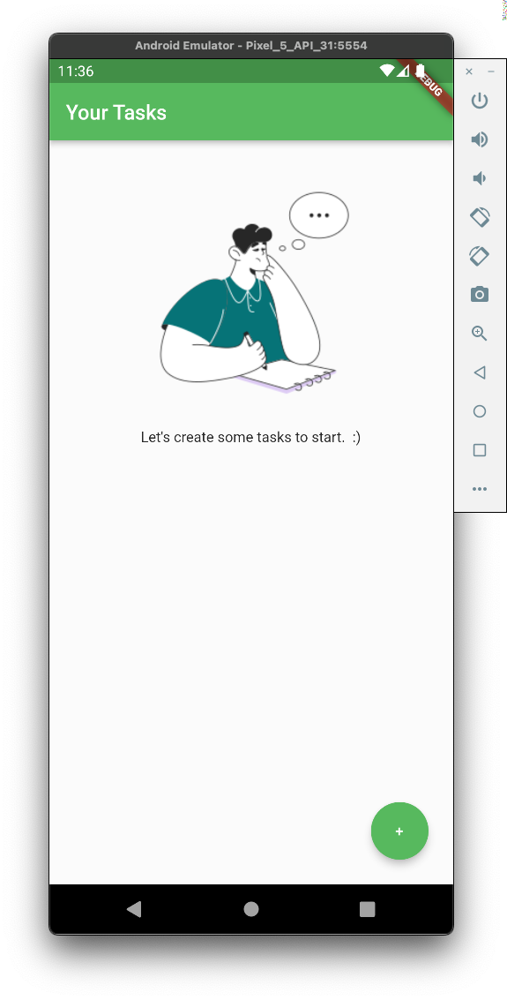
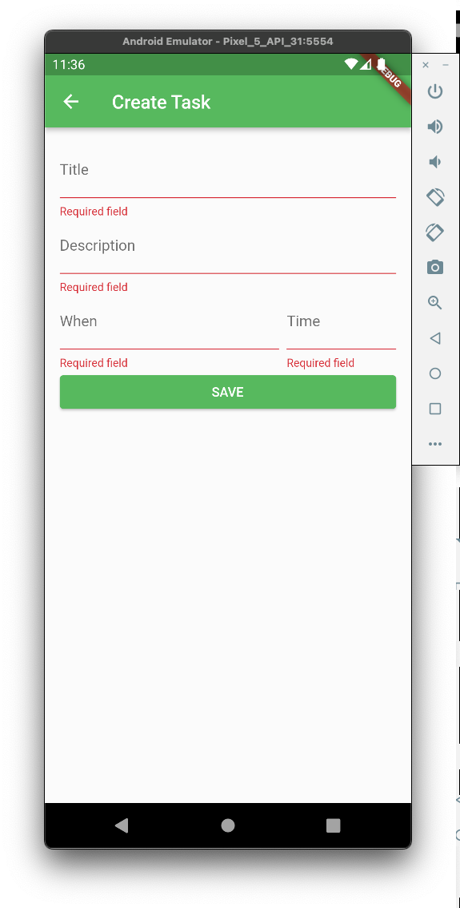
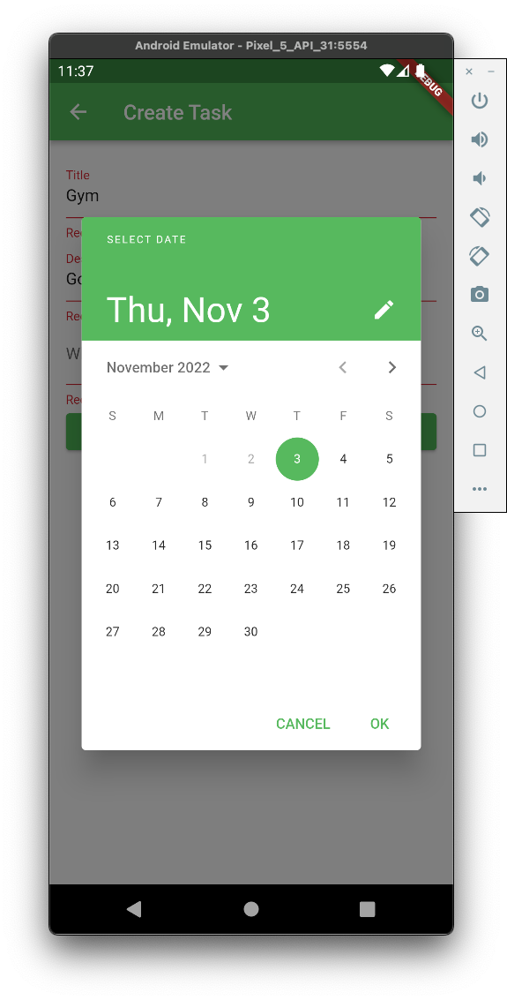
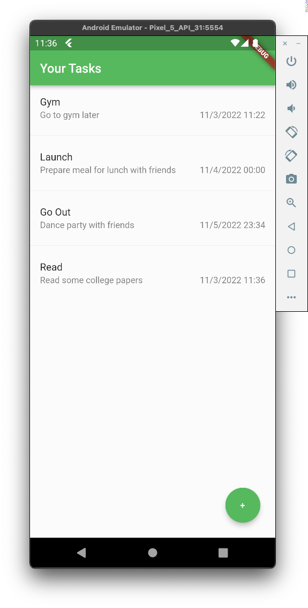
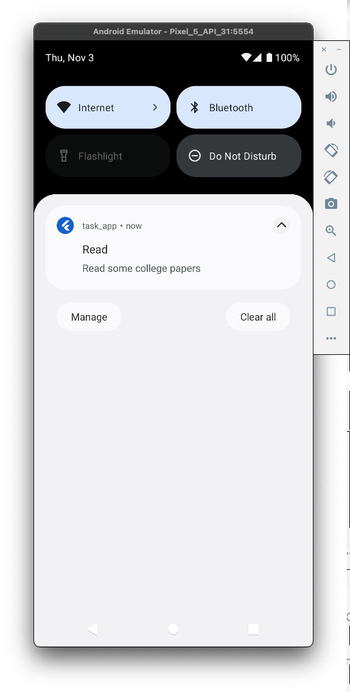

# TASKS_APP

Simple task reminder app for case study:
- Show all tasks created with empty state.
- Add task with field validations, date and time system picker, schedule notification.
- Show local notification scheduled from app.

## Dev

Simple clean archicture separating some concerns of presentation, domain and data.
- Presentation: create views and handle state management with bloc library.
- Domain: handle models and use cases for handling business logic.
- Data: implementation of repository to access data (send to api, or cache) in this case using shared_preferences library to save locally the data.

## Getting Started

This project is a starting point for a Flutter application.

A few resources to get you started if this is your first Flutter project:

- [Lab: Write your first Flutter app](https://docs.flutter.dev/get-started/codelab)
- [Cookbook: Useful Flutter samples](https://docs.flutter.dev/cookbook)

For help getting started with Flutter development, view the
[online documentation](https://docs.flutter.dev/), which offers tutorials,
samples, guidance on mobile development, and a full API reference.
